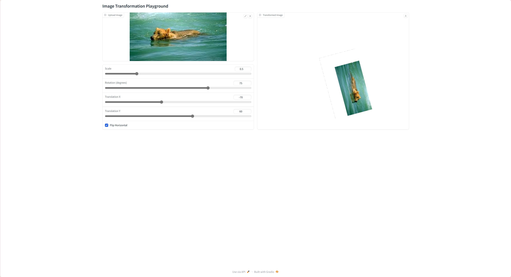
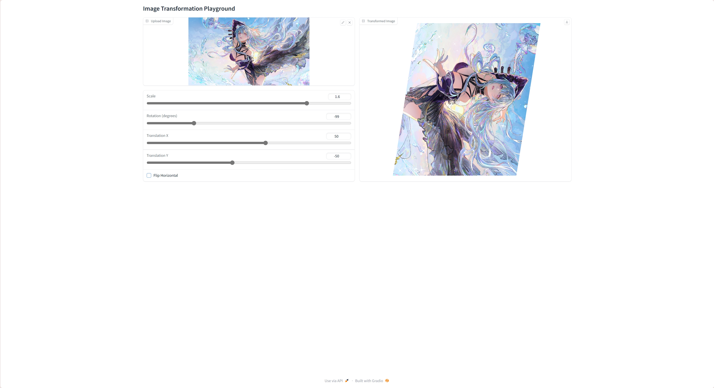
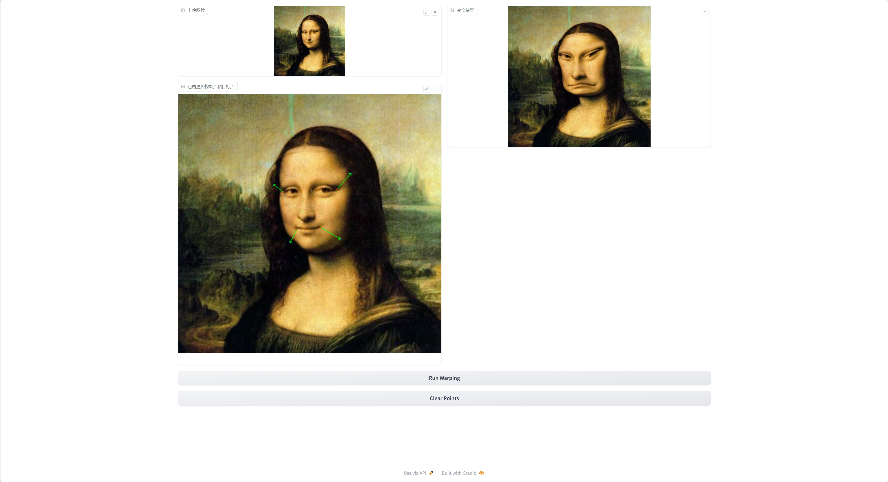
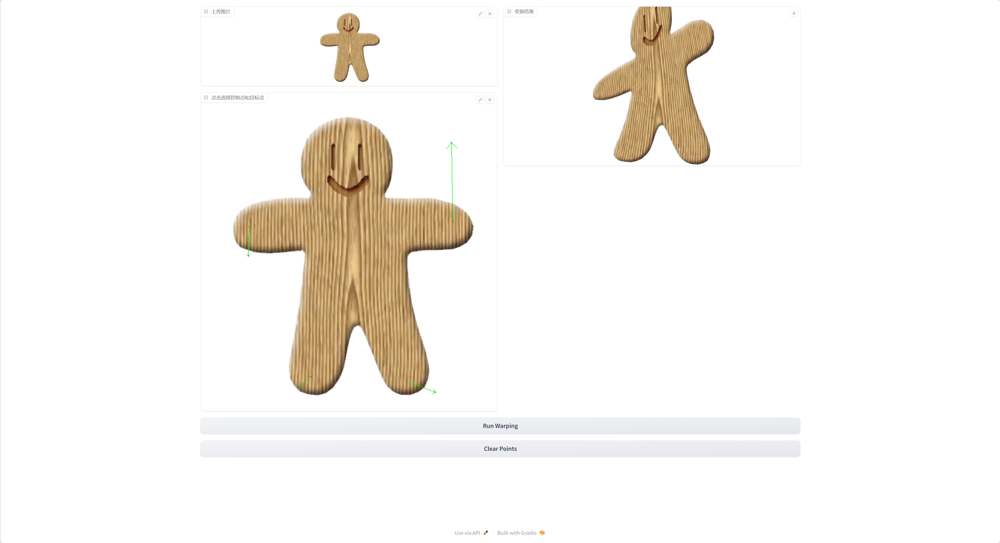

# Assignment 1 - Image Warping


### 1. Basic Image Geometric Transformation (Scale/Rotation/Translation).


### 2. Point Based Image Deformation.


---


## Implementation of Image Geometric Transformation

### 1. Basic Image Geometric Transformation

In the `run_global_transform.py` file, we implement basic image geometry transformations, including scaling, rotation, and translation. Users can upload images through the Gradio interface and adjust the transformation parameters using sliders and checkboxes.

#### Main steps:

1. **Image Transformation**: convert the uploaded image from PIL format to NumPy array.
2. **Image Fill**: To avoid boundary problems, we add white fill around the image.
3. **Transform Matrix**: Generate the transform matrix for scaling, rotation and translation and combine them into a composite transform matrix.
4. **Apply Transform**: Apply the transform matrix using OpenCV's `cv2.warpPerspective` function.
5. **Results Merge**: Merge the transformed image with a white background, making sure that only the original part of the image is transformed and the rest stays white.

### 2. Point Based Image Deformation

In the `run_point_transform.py` file, we have implemented image deformation based on control and target points. The user can upload an image through the Gradio interface and click to select the control and target points and the algorithm will deform the image based on these points.

#### Main steps:

1. **Upload image**: clear the previous control points and target points and upload a new image.
2. **Record Click Points**: record the control and target points clicked by the user and mark these points on the image and draw arrows from the control points to the target points.
3. **RBF Kernel Matrix**: computes the Radial Basis Function (RBF) kernel matrix for point guided deformation.
4. **Calculate coefficients**: calculates the coefficients required for deformation by solving a system of linear equations.
5. **Create grid**: generates grid points for the image and calculates the grid point positions after deformation.
6. **Apply deformation**: generates the deformed image based on the positions of the deformed grid points.

## Requirements

To install requirements:

```setup
python -m pip install -r requirements.txt
```


## Running

To run basic transformation, run:

```basic
python run_global_transform.py
```

To run point guided transformation, run:

```point
python run_point_transform.py
```

## Results
### Basic Transformation



### Point Guided Deformation:



## Acknowledgement

>📋 Thanks for the algorithms proposed by [Paper: Image Warping by Radial Basis Functions](https://www.sci.utah.edu/~gerig/CS6640-F2010/Project3/Arad-1995.pdf).
