# Assignment 2 - DIP with PyTorch

## 1.Traditional DIP (Poisson Image Editing) with PyTorch

## 2.Deep Learning DIP (Pix2Pix) with Pytorch

## Resources

- [Assignment Slides](https://rec.ustc.edu.cn/share/705bfa50-6e53-11ef-b955-bb76c0fede49)  
- [Paper: Poisson Image Editing](https://www.cs.jhu.edu/~misha/Fall07/Papers/Perez03.pdf)
- [Paper: Image-to-Image Translation with Conditional Adversarial Nets](https://phillipi.github.io/pix2pix/)
- [Paper: Fully Convolutional Networks for Semantic Segmentation](https://arxiv.org/abs/1411.4038)
- [PyTorch Installation & Docs](https://pytorch.org/)

---

## 1. Implement Poisson Image Editing with PyTorch

Poisson Image Editing 是一种图像处理技术，用于将一个图像的选定区域无缝地融合到另一个图像中。其核心思想是通过求解泊松方程，使得融合区域的梯度与周围区域一致，从而实现无缝融合。

### Main Steps

1. **加载图像：** 读取前景图像和背景图像。
2. **选择区域：** 用户在前景图像上选择一个多边形区域。
3. **计算掩码：** 根据选择的多边形区域生成掩码。
4. **泊松融合：** 通过求解泊松方程，将前景图像的选定区域无缝地融合到背景图像中。
5. **显示结果：** 展示融合后的图像。

### Results

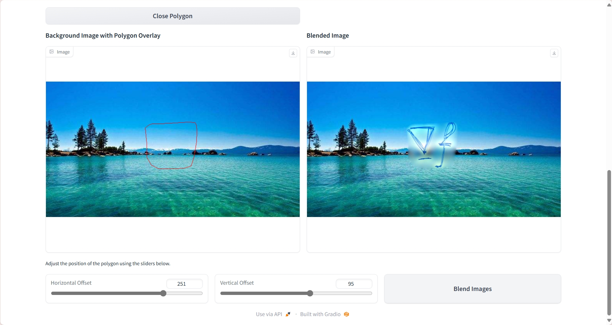
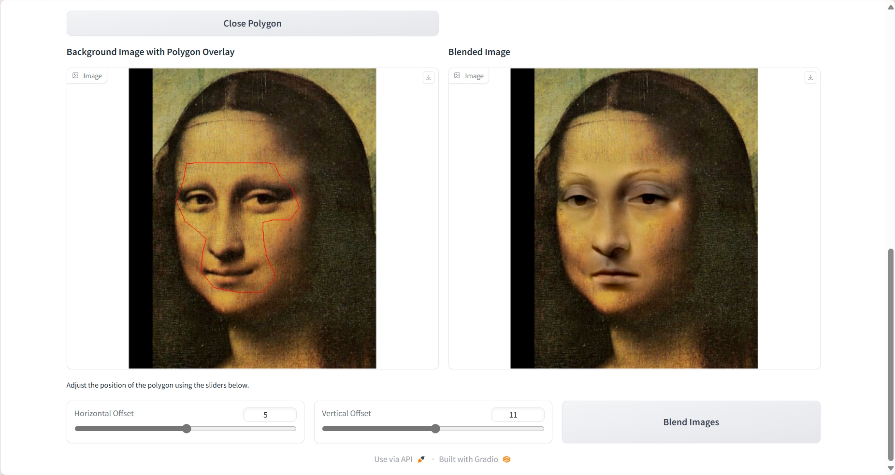
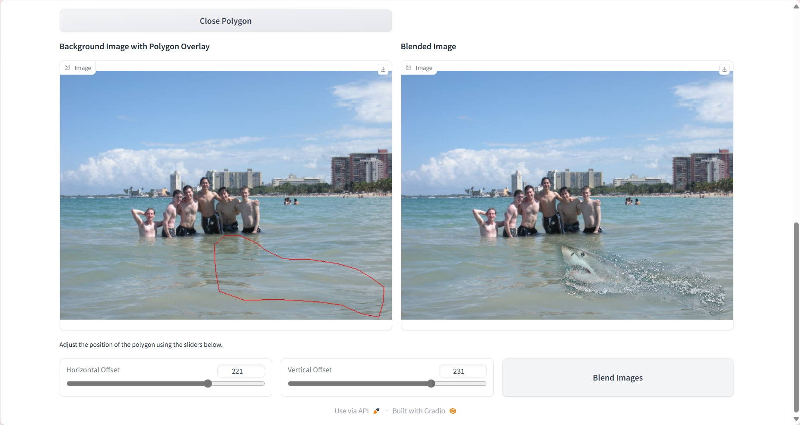

## 2. Pix2Pix implementation

Pix2Pix 是一种基于条件生成对抗网络（Conditional GAN）的图像到图像翻译技术。其核心思想是通过生成器和判别器的对抗训练，使得生成器能够将输入图像转换为目标图像。

### Main Steps

1. **准备数据集：** 下载并准备 Facades 数据集。
2. **定义模型：** 实现生成器和判别器网络。
3. **训练模型：** 使用训练数据集训练 Pix2Pix 模型。
4. **验证模型：** 在验证数据集上验证模型性能。
5. **保存结果：** 保存训练和验证结果。

### Results

#### val results of facades dataset

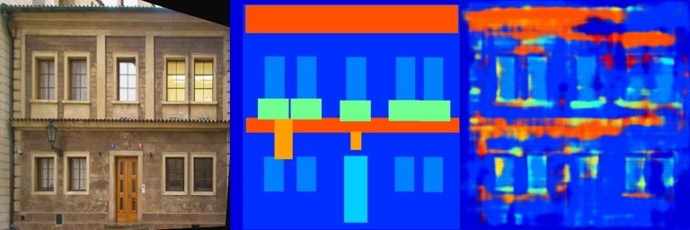
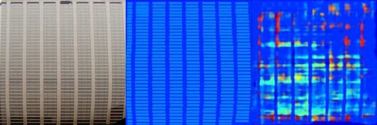
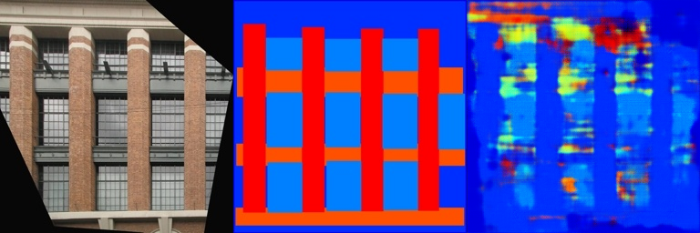
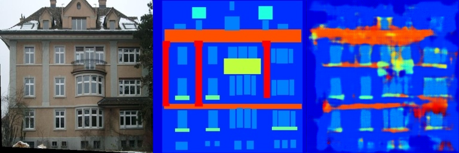
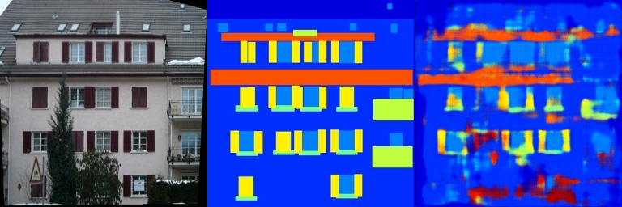

#### val results of cityscapes dataset

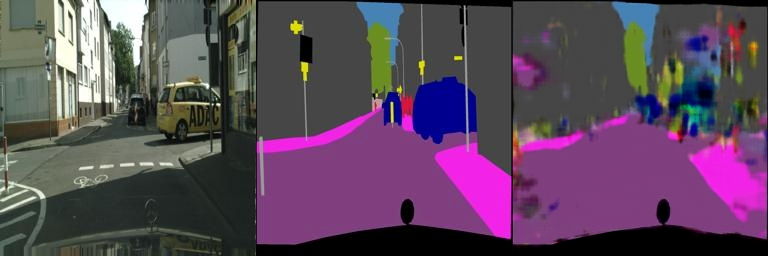
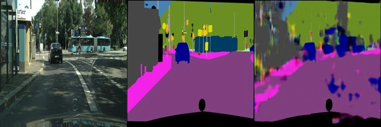
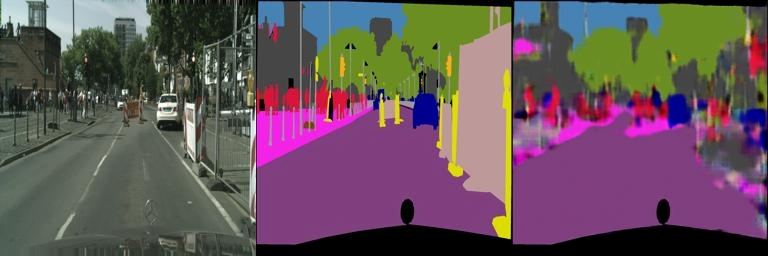
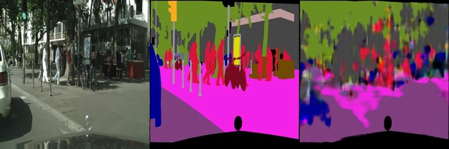
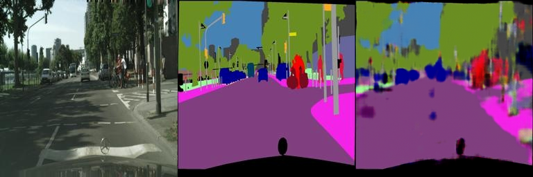

---

## Requirements

- 使用与[**01 Image Warping**](../01_ImageWarping/README.md)相同的虚拟环境
- 安装与GPU支持的CUDA版本，并配置对应的PyTorch
- **Pix2Pix** 的数据库导入见[README.md](Pix2Pix/README.md)
