# Assignment 3 - Play with GANs

## 1.Deep Learning DIP (Pix2Pix) with Discriminative loss

## 2. Combining DragGAN with Automatic Face Landmarks

## Resources

- [Paper: Image-to-Image Translation with Conditional Adversarial Nets](https://phillipi.github.io/pix2pix/)
- [Paper: Fully Convolutional Networks for Semantic Segmentation](https://arxiv.org/abs/1411.4038)
- [PyTorch Installation & Docs](https://pytorch.org/)
- [DragGAN](https://github.com/XingangPan/DragGAN)
- [Automatic Face Landmarks](https://github.com/1adrianb/face-alignment) 

---

## 1. Pix2Pix implementation

Pix2Pix 是一种基于条件生成对抗网络（Conditional GAN）的图像到图像翻译技术。其核心思想是通过生成器和判别器的对抗训练，使得生成器能够将输入图像转换为目标图像。

### Main Steps

1. **准备数据集：** 下载并准备 Facades 数据集。
2. **定义模型：** 实现生成器和判别器网络。
3. **训练模型：** 使用训练数据集训练 Pix2Pix 模型。
4. **验证模型：** 在验证数据集上验证模型性能。
5. **保存结果：** 保存训练和验证结果。

### Results

#### val results of facades dataset

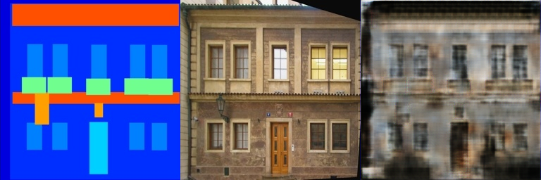
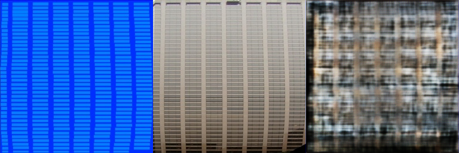
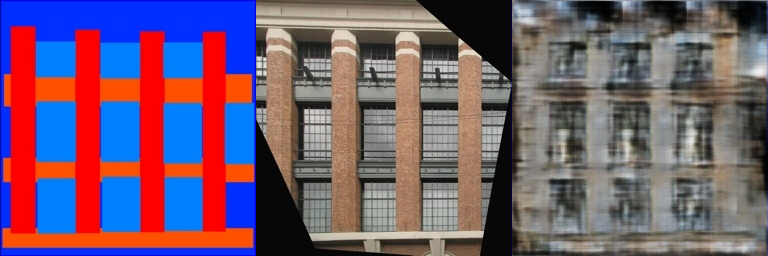
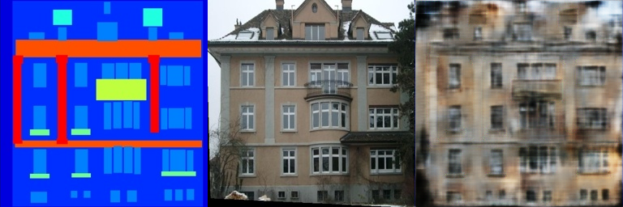
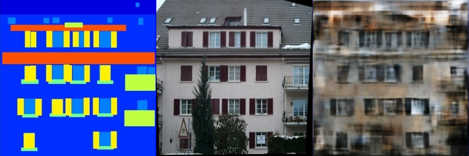

#### val results of cityscapes dataset

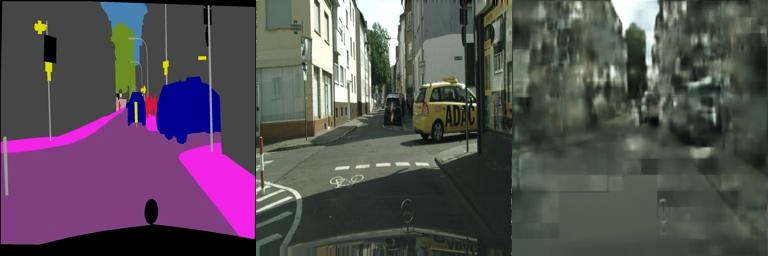
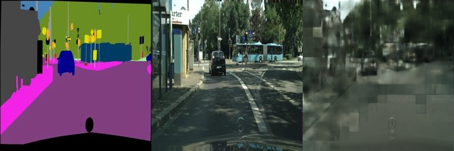
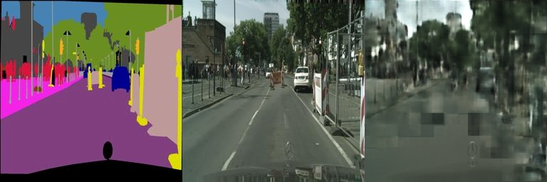
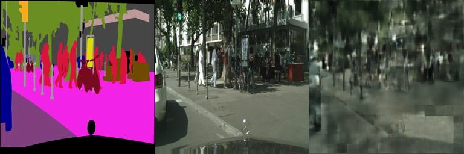
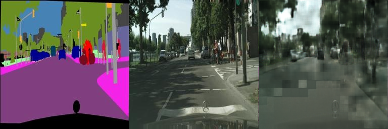

## 2. Combine DragGAN with Automatic Face Landmarks

### Results

#### smile

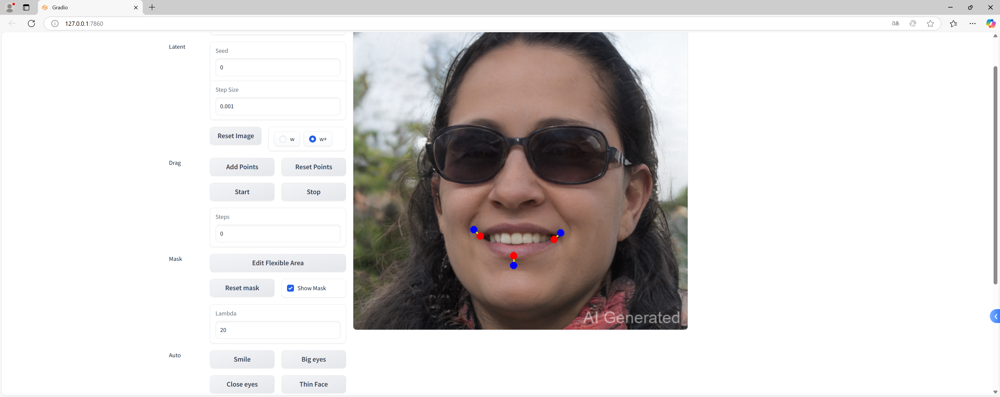
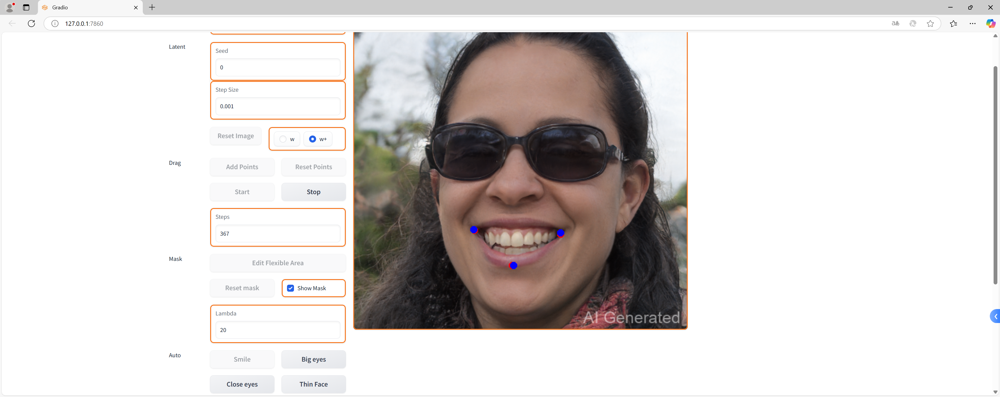

#### face slimming

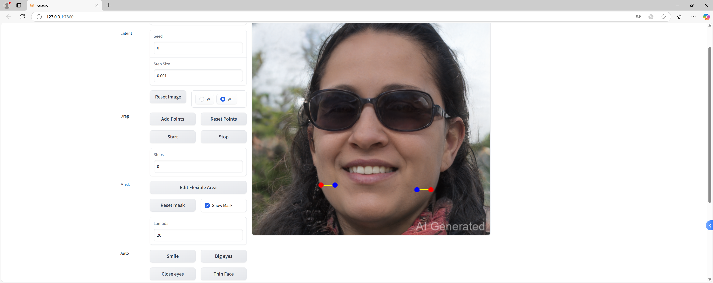
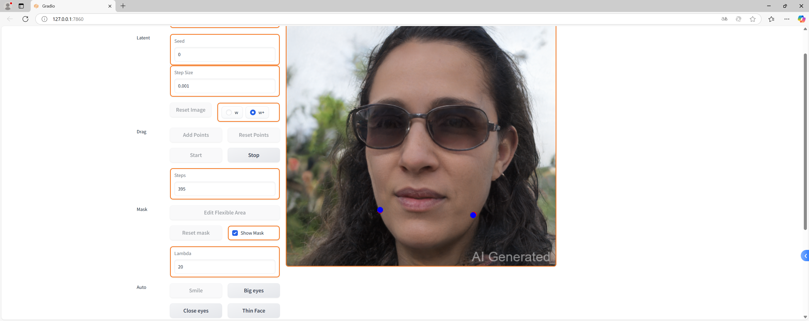

#### big eyes

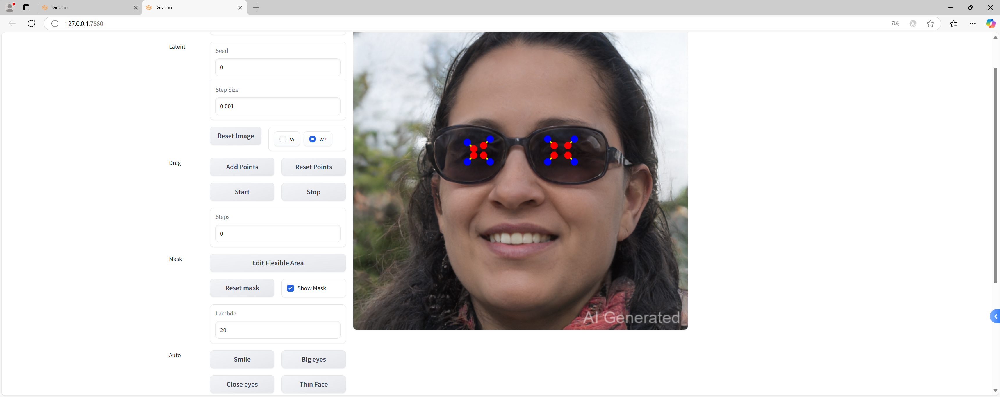
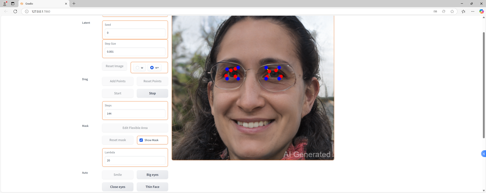

## Requirements

---

- 使用与[**01 Image Warping**](../01_ImageWarping/README.md)相同的虚拟环境
- 安装与GPU支持的CUDA版本，并配置对应的PyTorch
- **Pix2Pix** 的数据库导入见[README.md](Pix2Pix/README.md)
- **GragGAN**的相应配置见[requirements.txt](DragGAN/requirements.txt)
